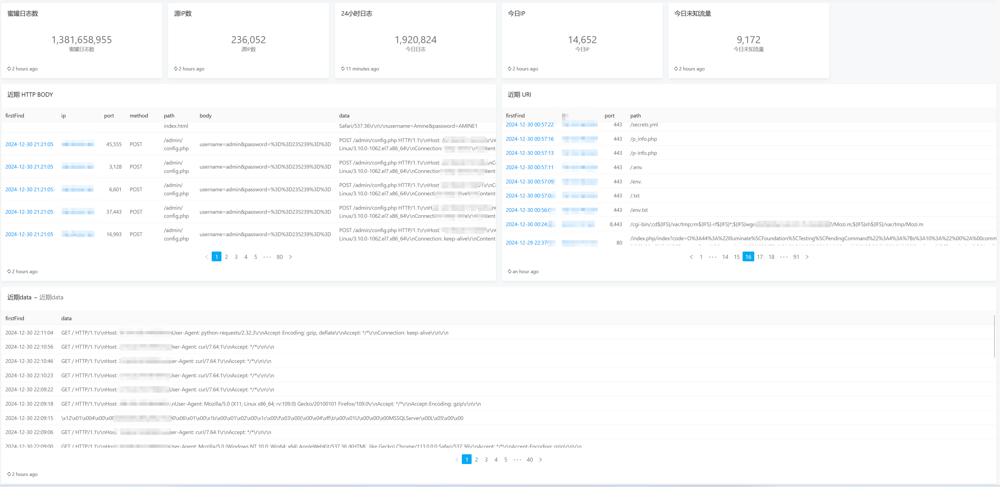
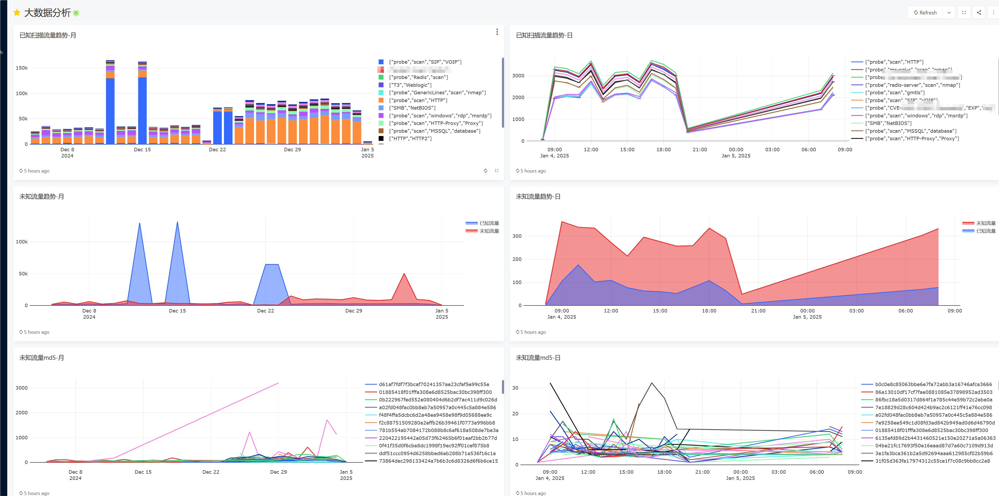

# hachimi

一个分布式蜜网系统，用于收集和分析来自互联网的背景噪音 (Internet Background Noise)。

互联网背景噪音是指来自互联网的大量扫描、攻击、恶意软件传播等流量。这些流量通常是由恶意软件、僵尸网络、漏洞扫描器等产生的，对网络安全和数据分析有很大的帮助。

该项目通过linux透明代理来实现全端口监听，根据请求数据推测请求协议并模拟对应服务的响应。
# 系统架构
```
                 ┌─────┐  ┌─────┐  ┌─────┐                    
                 │ POT │  │ POT │  │ POT │  ...               
                 └──┬──┘  └──┬──┘  └──┬──┘                    
                    │        │ logs   │                       
                    │   ┌────▼────┐   │                       
┌──────────┐        └──►│   NSQ   │◄──┘                       
│          │            └────┬────┘                           
│  Redash  │          ┌──────┴───────┐                        
│          │          │              │                        
└──────────┘     ┌────▼───┐     ┌────▼───┐                    
     ▲           │ hunter ├──┬──┤ hunter │  ...              
     │           └────────┘  │  └────────┘                    
     │                       │                                
     │                ┌──────▼───────┐                        
     │                │              │                        
     └────────────────┤  Clickhouse  │                        
                      │              │                        
                      └──────────────┘                        
POT: 蜜罐节点
NSQ: 消息队列服务器 NSQD
hunter: 分析节点
Clickhouse: 数据库
Redash: 可视化分析平台

蜜罐节点将流量分析后发送到消息队列中，分析节点消费消息队列中的数据，将数据存储到数据库中，最后通过可视化工具展示数据。
```
<!-- https://asciiflow.com/#/share/eJyrVspLzE1VslIKzSvJLMlJTVFIKUosz8xLVzBS0lHKSaxMLQJKVscolaUWFWfm58UoWRnpxChVAGlLc1MgqxIkYmkGZJWkVpQAOTFKCujg0ZSeR1MaUNEEUoUxQUxMHharmhQC%2FEPANB6Onp4eUYZNgTlgDYwxg1Rh4twNdToSMyc%2FvRhVlBRj0ANx2h7MAMVrNLZYwBUpCJ9P2wUx1C84EGLBo%2BkteMMCZhmSS9CchRSsaIGL31hko4NSUxKLM9CMxuHDLYR8S5L7McIYd6BDDJqCw3o0%2F%2BKN3wnEKsF0AETntE1oLs4ozStJLQIy52DEwhKEJLaMFQQ3FMXjeD06QwGWZfErwuMDnKGMJ%2FyJMAR7mkHPXESlGdxWkJRioEoIJhtMtERBwTknMzk7I7%2B0OJUoazAAOW7FYghJjseZ32OUapVqAcVYjIQ%3D) -->


## 网络支持
- [x] IPv4
- [x] IPv6

## 协议支持
- TCP
- UDP
- HTTP
- TLS
- SSH
- REDIS
- TODO
### HTTP
- [x] 自动识别
- [x] 协议解析
- [x] 响应模拟
- [x] 插件系统
- [x] 日志记录
#### 协议自动识别
-  根据首包开头前10字节 判断是否是 HTTP 请求方法. `POST, GET, HEAD, OPTIONS, DELETE, PUT, TRACE, CONNECT, PATCH`
-  根据首包开头前1k字节 判断是否存在 HTTP协议头  `GET / HTTP/1.1`
#### 协议解析
-  使用`fasthttp`接管传入的连接，解析请求头，请求体等信息
#### 响应模拟
-  使用`fasthttp` 生成响应数据
#### 插件系统
-  使用 `yaegi` 实现插件系统，可以自由的使用golang编写灵活的HTTP请求处理逻辑 来处理`fasthttp`传入的请求. 可以实现对某些特定请求的处理.
-  插件系统支持热加载，无需重启系统即可生效

例如: 诱捕D-Link NAS设备命令注入漏洞（CVE-2024-3273）
```go
package server
func RequestHandler(plog *types.HttpLog, ctx *fasthttp.RequestCtx) {
	r := router.New()
	r.GET("/cgi-bin/nas_sharing.cgi", dlinkNas)
}
func dlinkNas(ctx *fasthttp.RequestCtx) {
	ctx.Response.Header.Set("Content-Language", "en")
	ctx.Response.Header.Set("Server", "lighttpd/1.4.28")
	ctx.Response.Header.Set("P3p", "CP='CURa ADMa DEVa PSAo PSDo OUR BUS UNI PUR INT DEM STA PRE COM NAV OTC NOI DSP COR'")
	user := string(ctx.QueryArgs().Peek("user"))
	if user == "messagebus" {
		system := string(ctx.QueryArgs().Peek("system"))

		switch system {
		case "ZWNobwktZQlcXHg2OVxceDY0fHNo":
			ctx.WriteString("uid=0(root) gid=0(root)\n")
			break
		case "aWQ=":
			ctx.WriteString("uid=0(root) gid=0(root)\n")
			break
		case "bHM=":
			ctx.WriteString("account_mgr.cgi\napkg_mgr.cgi\napp_mgr.cgi\nbox.cgi\ncodepage_mgr.cgi\ndownload_mgr.cgi\nfolder_tree.cgi\ngdrive.cgi\nget_xml.cgi\ngui_mgr.cgi\nhd_config.cgi\ninfo.cgi\nisomount_mgr.cgi\nlocal_backup_mgr.cgi\nlogin_mgr.cgi\nmyMusic.cgi\nmydlink.cgi\nmydlink_account_mgr.cgi\nmydlink_sync_mgr.cgi\nnas_sharing.cgi\nnetwork_mgr.cgi\np2p.cgi\np2p_upload.cgi\nphotocenter_mgr.cgi\nremote_backup.cgi\ns3.cgi\nscan_dsk.cgi\nsmart.cgi\nstatus_mgr.cgi\nsystem_mgr.cgi\ntime_machine.cgi\nusb_backup.cgi\nusb_device.cgi\nve_mgr.cgi\nwebdav_mgr.cgi\nwebfile_mgr.cgi\nwidget_api.cgi\nwizard_mgr.cgi\n")
			break
		case "dW5hbWUJLW0=":
			ctx.WriteString("armv5tel\n")
		default:
			decodeString, _ := base64.StdEncoding.DecodeString(system)
			a, err := strconv.Unquote(`"` + string(decodeString) + `"`)
			if err == nil {
				decodeString = []byte(a)
				a, err = strconv.Unquote(`"` + string(decodeString) + `"`)
				if err == nil {
					decodeString = []byte(a)
				}

			}
			if string(decodeString) != "" {
				ctx.WriteString(string(decodeString) + "\n")
			}

			break
		}

		ctx.WriteString(`<?xml version="1.0" encoding="UTF-8"?>
<config><nas_sharing><auth_state>1</auth_state></nas_sharing></config>
`)
	} else {
		ctx.WriteString(`<?xml version="1.0" encoding="UTF-8"?>
<config><nas_sharing><auth_state>0</auth_state></nas_sharing></config>
`)
	}
}
```
#### 日志记录
除了请求IP端口等标准会话信息外，还记录了请求的详细信息，包括请求头，请求体，请求方法，请求路径等信息

日志格式
``` go
type Http struct {
	Session
	ID        string            `json:"id"`
	SessionID string            `json:"session_id"`
	StartTime time.Time         `json:"start_time"`
	EndTime   time.Time         `json:"end_time"`
	Header    map[string]string `json:"header"`
	UriParam  map[string]string `json:"uri_param"`
	BodyParam map[string]string `json:"body_param"`
	Method    string            `json:"method"`
	Path      string            `json:"path"`
	UA        string            `json:"ua"`
	Host      string            `json:"host"`
	RawHeader string            `json:"raw_header"`
	Body      string            `json:"body"`
	Service   string            `json:"service"`
	//经过的时间 ms
	Duration  int `json:"duration"`
}
```
### TLS
- [x] 自动识别
- [x] 协议解析
- [x] 响应模拟
- [ ] 插件系统
- [ ] 日志记录
#### 协议自动识别
-  根据首包开头前2字节 判断是否是 TLS ClientHello  `0x16 0x03`  (TLS 1.0 1.1 1.2 1.3)
#### 协议解析
-  使用go标准库`crypto/tls`接管传入的连接，解析TLS握手包，
#### 响应模拟
-  接管后的TLS连接会发送到下游其他协议识别模块进行处理
#### 日志记录
-   JA3指纹记录  TODO
-   SNI记录 TODO
### SSH
- [x] 自动识别
- [x] 协议解析
- [x] 响应模拟
- [ ] 插件系统
- [ ] 日志记录
#### 协议自动识别
-  根据首包开头前10字节 判断是否是 SSH 客户端版本信息  `SSH-2.0-`
#### 协议解析
-  使用go标准库`golang.org/x/crypto/ssh`接管传入的连接，解析SSH握手包，
#### 响应模拟
-  接管后的SSH连接会发送到下游其他协议识别模块进行处理, 可以在这里实现SSH协议的交互和非交互的shell处理
-  实现SSH中继与录像 用于真实环境模拟 `TODO`
#### 日志记录
-   SSH会话记录包含了SSH会话的详细信息，包括SSH客户端版本，非交互shell命令，`SSH channel`原始数据，SSH认证公钥，是否交互，认证用户密码等信息
-   日志中记录了完整的SHELL会话 包含了非交互和交互的shell命令与会话数据
```go
type SSHSession struct {
	types.Session
	ID            string    `gorm:"primaryKey" json:"id"`
	SessionID     string    `gorm:"index" json:"session_id"`
	StartTime     time.Time `gorm:"index" json:"start_time"`
	EndTime       time.Time `gorm:"index" json:"end_time"`
	Duration      int       `json:"duration"`
	ClientVersion string    `json:"client_version"`
	Shell         string    `json:"shell"`
	Request       string    `json:"request"`
	Error         bool      `json:"error"`
	PublicKey     string    `json:"public_key"`
	Service       string    `json:"service"`
	User          string    `json:"user"`
	Data          string    `json:"data"`
	IsInteract    bool      `json:"is_interact"`
	PassWord      string    `json:"password"`
}
```
### REDIS
- [x] 自动识别
- [x] 协议解析
- [x] 响应模拟
- [ ] 插件系统
- [x] 日志记录
#### 协议自动识别
-  根据首包开头前2字节 判断是否是 REDIS 请求格式 `*n`
-  根据端口与数据反序列化判断是否是REDIS服务
#### 协议解析
-  解析REDIS请求包，提取REDIS请求命令. 这里使用了 `Docker`的部分代码 用于解析REDIS请求包
#### 响应模拟
-  目前只有对所有已知的REDIS命令直接进行OK响应
#### 日志记录
-   REDIS会话记录包含了REDIS请求命令，请求参数等信息


## 部署
[部署文档](docs/deploy.md)


## 数据展示




## 数据分析

## 开源数据
开源互联网背景噪音数据集，包含了2024年9月到2025年1月的约1000万条HTTP请求数据。，数据集为Parquet格式，包含了请求的时间、源IP端口、请求方法、请求路径、请求头、请求体等信息。
[数据集地址](https://huggingface.co/datasets/burpheart/Internet-background-noise)